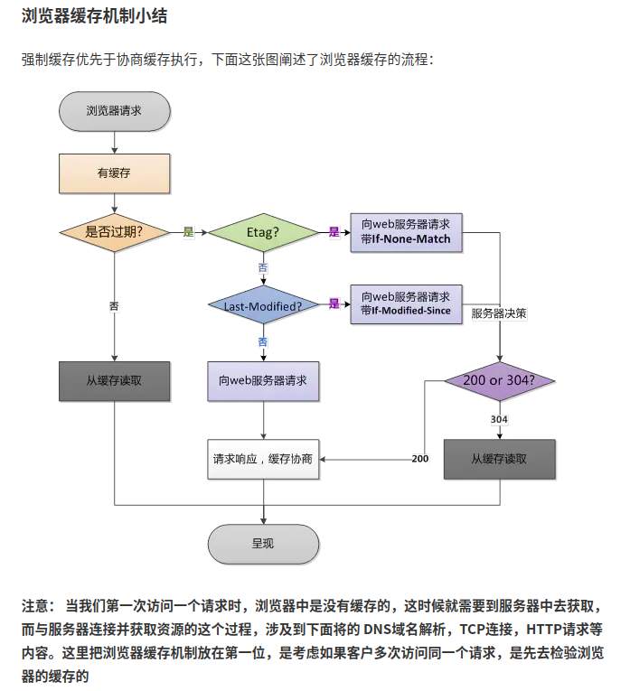
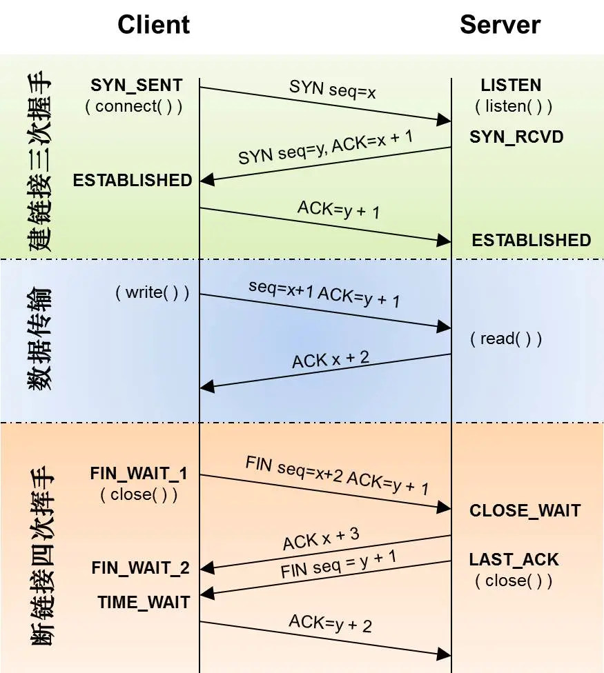

# 一个URL请求的大概过程

**在浏览器中输入一个URL访问地址，然后浏览器返回给我们一个响应页面，这内部过程**

引用:[https://juejin.im/post/6844903665631756295#heading-6](https://juejin.im/post/6844903665631756295#heading-6)

## 浏览器缓存小结 <a href="#liu-lan-qi-huan-cun-xiao-jie" id="liu-lan-qi-huan-cun-xiao-jie"></a>



## DNS域名解析 <a href="#dns-yu-ming-jie-xi" id="dns-yu-ming-jie-xi"></a>


计算机之间只能通过ip相互通信，因为ip不好记，于是才使用dns服务器把域名解析为相应的ip，\
这里以解析www.taobao.com为例-->当我们输入这个网址回车的时候，浏览器-->会首先查询浏览器的缓存\
\-->如果没找到-->则去查询本地的dns缓存和hosts文件，如果有www.taobao.com这个域名对应的ip，则直接通过这个ip访问网站服务器。如果本地的dns缓存和hosts文件没找到-->这时候就会把请求发送给，网卡配置信息里的dns服务器，默认有两个，只有当dns1不能访问时，才会使用dns2(运营商)。我们也称网卡配置信息里的dns为local dns，这时候local dns会先查询它的缓存，有没有www.taobao.com相应的记录，如果有，则返回给用户，如果没有

\-->就会访问根域名服务器，世界一共有13台根域名服务器，是找.com的，于是会把.com的顶级域名服务器的ip发送给local dns-->这时local dns再次访问.com的顶级域名服务器，是找一级域名taobao.com的，于是再将taobao.com的ip发送给local dns-->然后继续往下找，直到找到www.taobao.com的权威dns的A记录或者cname

\-->local dns会把找到的www.taobao.com的ip发送给客户端，并记录在缓存中。客户端收到local dns发送过来的ip就会通过ip去访问服务器，并将这个ip记录在dns缓存中。如果url里不包含端口号，则会使用该协议的默认端口号。

## TCP连接 <a href="#tcp-lian-jie" id="tcp-lian-jie"></a>

在浏览器发送http请求之前，**需要在浏览器和服务器之间建立一条TCP/IP连接**\
tcp连接的端点叫套接字（socket），根据RFC 793的定义，**端口号拼接到IP地址即构成了套接字**。\
**TCP连接主要分为建立连接(三次握手)，数据传输，断开连接(四次挥手)，下图给出了TCP的通信过程**\
\
**三次握手：**

```
A:“喂，你听得到吗？”
B:“我听得到呀，你听得到我吗？”
A:“我能听到你，今天balabala……”
```

**四次挥手**

复制代码客户端先向服务端发送关闭请求，表示客户端不再发送数据了，服务端确认，但是，此时服务端还可以接着向客户端发送消息，待服务端没有数据传送时，此时服务端也向客户端发送关闭请求，然后客户端确认

**TCP的半关闭**\
就像上面所说，TCP存在半关闭的状态，虽然一些应用需要此功能，但它并不常见。TCP的半关闭就是指当一方已经完成了数据的发送工作，并发送了一个FIN给对方，但是它仍然希望接收来自对方的数据，直到对方发送一个FIN给它，这种情况下它就处于TCP的半关闭状态。

**为什么客户端要在TIME-WAIT状态必须等待2MSL的状态**

TIME\_WAIT状态也称为 2MSL 等待状态。在该状态下，TCP 将会等待两倍于最大段生存期(MSL)的时间，有时也被称作加倍等待。这样就能够让TCP重新发送最终的ACK 以避免出现丢失的情况，重新发送最终的 ACK 并不是因为TCP重传了 ACK (它们不消耗序列号，也不会被TCP重传)，而是因为通信另一方重传了它的 FIN (它消耗一个序列号)

## HTTP请求与响应 <a href="#http-qing-qiu-yu-xiang-ying" id="http-qing-qiu-yu-xiang-ying"></a>

**浏览器与服务器建立TCP连接以后，然后就可以开始发起HTTP请求了，客户端按照指定格式开始向服务器发送HTTP请求，服务端接收请求后，解析HTTP请求，处理完业务逻辑，返回一个HTTP响应给客户端**
